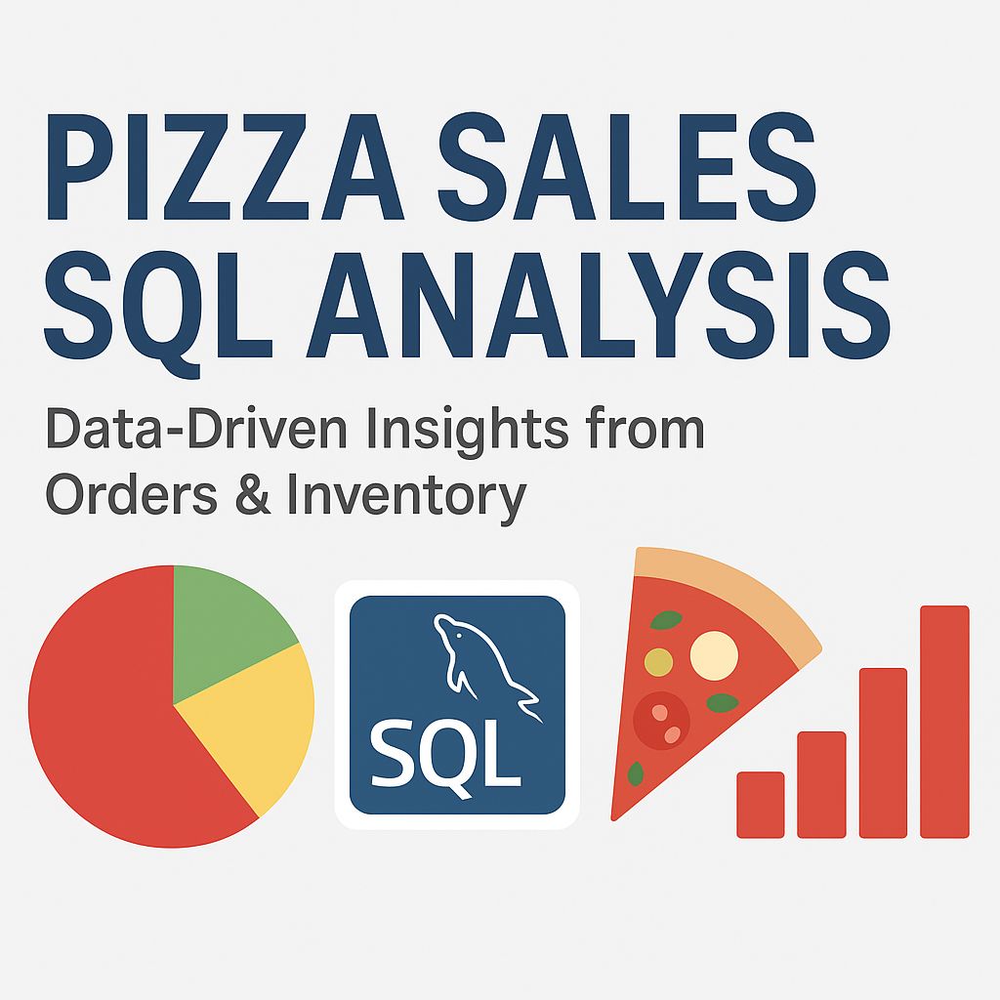

# 🍕 MySQL Pizza Sales Analysis

This project is an end-to-end SQL-based data analysis of a fictional pizza restaurant's sales data. The goal is to derive meaningful insights from raw transactional data using SQL queries and summarize key business metrics.

---

## 📌 Project Overview

- **Domain**: Food & Beverage
- **Skills Used**: SQL, Data Cleaning, Data Analysis, Joins, Aggregation
- **Tools**: MySQL, Excel (for visualization/reporting)
- **Report**: [Pizza Sales Analysis PDF](Pizza_sales_analysis.pdf)

---

## 📊 Dataset Description

The data consists of 4 CSV files:

| File Name          | Description                          |
|--------------------|--------------------------------------|
| `orders.csv`       | Contains order-level metadata        |
| `order_details.csv`| Line-item details for each order     |
| `pizzas.csv`       | Pizza types with size and price info |
| `pizza_types.csv`  | Pizza category, ingredients, name    |

---

## 🎯 Key Business Questions Answered

- What is the total revenue generated?
- What are the top 5 best-selling pizzas?
- What is the most popular pizza category?
- What is the distribution of pizza sizes sold?
- What are the busiest times (day/hour) for orders?

---

## 🛠️ How to Use

1. Clone this repository
2. Import the SQL script `Pizza_sales.sql` into MySQL
3. Run the queries or use your own for custom insights
4. Refer to `Pizza_sales_analysis.pdf` for a summarized visual report

---

## 📎 Files Included

- `Pizza_sales.sql`: SQL script with all queries
- `Pizza_sales_analysis.pdf`: Business report of the findings
- CSVs:
  - `orders.csv`
  - `order_details.csv`
  - `pizza_types.csv`
  - `pizzas.csv`

---

## 👨‍💻 Author

**Shibam Dutta**  
[GitHub Profile](https://github.com/shibamdutta99)

---

## 📜 License

This project is for educational and portfolio purposes only.

